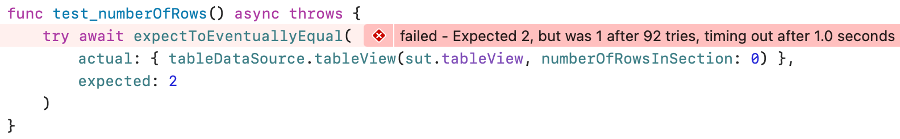

# ExpectToEventuallyEqual

[](https://github.com/jonreid/ExpectToEventuallyEqual/actions/workflows/build.yml)
[](https://swiftpackageindex.com/jonreid/ExpectToEventuallyEqual)
[](https://swiftpackageindex.com/jonreid/ExpectToEventuallyEqual)
[](https://iosdev.space/@qcoding)
[](https://www.youtube.com/@QualityCoding)

ExpectToEventuallyEqual is an assertion for asynchronous code that works with both XCTest and Swift Testing.

<!-- toc -->
## Contents

  * [Example](#example)
  * [How To Install](#how-to-install)
    * [Swift Package Manager](#swift-package-manager)
  * [Details](#details)
  * [Origin](#origin)<!-- endToc -->

## Example

Let's say we have a table view that reads from a view model. So the view model determines the number of rows in the table:

<!-- snippet: number-of-rows -->
<a id='snippet-number-of-rows'></a>
```swift
override func tableView(_ tableView: UITableView, numberOfRowsInSection section: Int) -> Int {
    results.count
}
```
<sup><a href='/SampleApp/SampleApp/TableViewController.swift#L23-L27' title='Snippet source file'>snippet source</a> | <a href='#snippet-number-of-rows' title='Start of snippet'>anchor</a></sup>
<!-- endSnippet -->

The table view controller's `viewDidLoad()` tells the view model to load, then reloads the table data. Because the `load()` is asynchronous, we await its results and wrap this inside a `Task`.

<!-- snippet: task -->
<a id='snippet-task'></a>
```swift
Task {
    results = await viewModel.load()
    self.tableView.reloadData()
}
```
<sup><a href='/SampleApp/SampleApp/TableViewController.swift#L15-L20' title='Snippet source file'>snippet source</a> | <a href='#snippet-task' title='Start of snippet'>anchor</a></sup>
<!-- endSnippet -->

If this `Task` included a call to a closure, tests could wait on an `XCTestExpectation` and inject a closure which calls `fulfill()` on the expectation. So one approach to testing this is to add a completion closure that fires after the data reloads.

Another approach is to check for some condition in periodic intervals. After stubbing two results into the view model, here's an `expectToEventuallyEqual` assertion that checks that the number of rows will eventually be 2:

<!-- snippet: test-example -->
<a id='snippet-test-example'></a>
```swift
try await expectToEventuallyEqual(
    actual: { tableDataSource.tableView(sut.tableView, numberOfRowsInSection: 0) },
    expected: 2
)
```
<sup><a href='/SampleApp/SampleAppTests/TableViewControllerTests_XCTest.swift#L33-L38' title='Snippet source file'>snippet source</a> | <a href='#snippet-test-example' title='Start of snippet'>anchor</a></sup>
<!-- endSnippet -->

The assertion repeatedly evaluates the `actual` closure, comparing it to the `expected` value. As soon as they are equal, this assertion will pass. If it times out with the values remaining unequal, the assertion fails.



There is a [SampleApp](SampleApp) you can try to see some passing tests and one failing test, using both XCTest and Swift Testing.

Note that any test that calls `expectToEventuallyEqual` must be declared `@MainActor`. This declaration can be at the test suite level.

## How To Install

### Swift Package Manager

If you have a `Project.swift` file, declare the following dependency:

```swift
dependencies: [
    .package(url: "https://github.com/jonreid/ExpectToEventuallyEqual", from: "2.0.0"),
],
```

Then add it to your test target:

```swift
.testTarget(
    name: "MyTests",
    dependencies: [
        "ExpectToEventuallyEqual",
    ],
```

## Details

The `actual` closure is allowed to throw exceptions.

The `actual` closure and  and `expected` value must evaluate to the same `Equatable` type.

The default `timeout` is 1 second. You can specify a different value.

After every comparison, the main dispatch queue runs briefly to process other tasks.

On failure, the assertion reports the expected value and the last actual value. If they are strings, the values are shown in double quotes with the following characters represented as escaped special characters:

- \\" (double quotation mark)
- \n (line feed)
- \r (carriage return)
- \t (horizontal tab)

## Origin

Jon Reid and Steven Baker created this assertion while teaching an iOS workshop together.

- Jon is the author of _[iOS Unit Testing by Example](https://iosunittestingbyexample.com)._ His website is [Quality Coding](https://qualitycoding.org).
- Steven is the inventor of RSpec and the describe/it pattern of testing. His website is [stevenrbaker.com](https://stevenrbaker.com).
